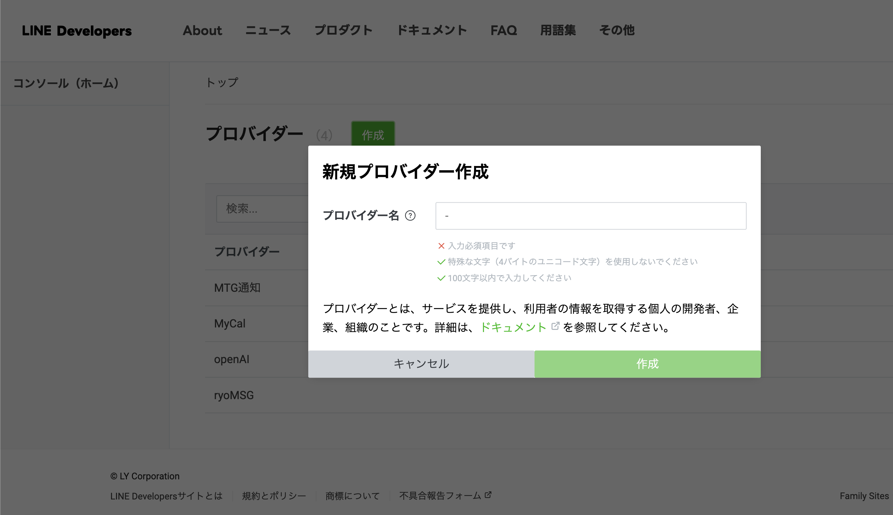
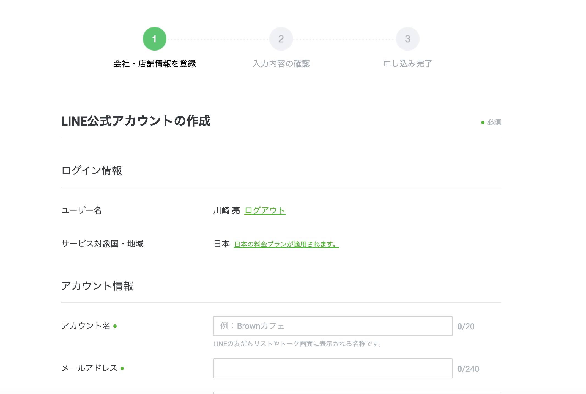
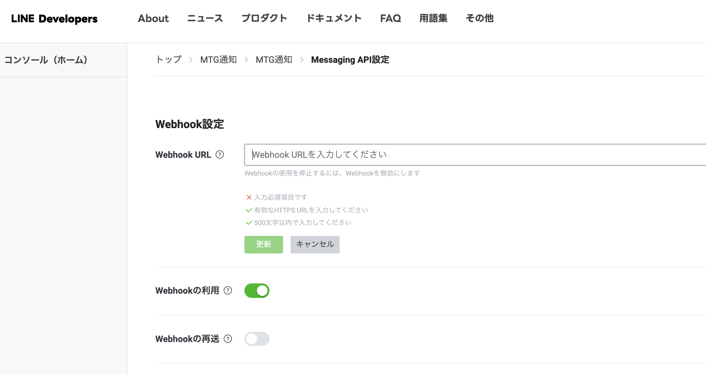

# ⚠️事項
1. mainブランチは環境整備の際のみ編集する
2. featureブランチを作成して、それをスプレッドシート側にpushする。
3. featureブランチをmainブランチにmergeしない。

# 1. 環境整備
## 1-1. envファイルの作成
```
cp .env.temp .env
```

## 1-2. `.clasp.json`にスプレッドシートのidを設定

## 1-3. GASログイン
```
clasp login
```

# 2. LINE連携
# 2-1. LINEプロバイダの新規作成
[LINE Developersコンソール](https://developers.line.biz/console/)にて、新規作成

# 2-2. LINE公式アカウントの作成


# 2-3. GASのデプロイ
以下の設定でデプロイし、発行したURLをLINE Message APIのwebhookに設定する

種類の選択
```
ウェブアプリ
```
アクセスできるユーザー
```
全員
```

# 2-4. LINE Messaging APIの設定
作成したLINEプロバイダの設定を開き
LINE Message APIの設定で、webhookに 2-3.で作成したURLを設定する


# 2-5. チャネルアクセストークンの発行と設定
LINE Message APIの設定画面でチャネルアクセストークンを発行し、`.env`ファイルの`CHANNEL_ACCESS_TOKEN`キーに設定する

# 2-6. GASを再度ビルドして、デプロイ